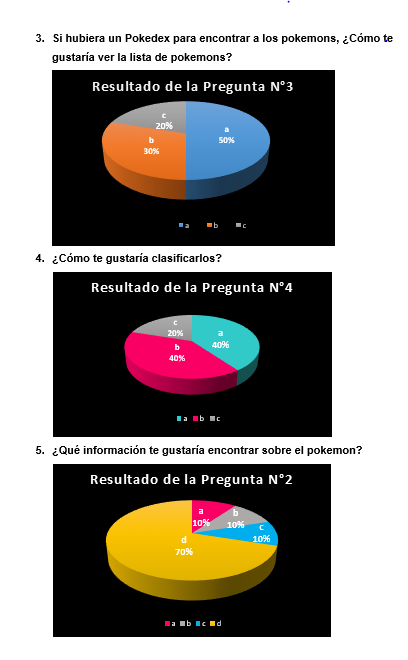

# Data Lovers

### PokeMag 

Es una plataforma que permite a sus usuarios obtener informacion sobre los pokemons de la region Kanto. En esta web los usuarios podran visualizar a los pokemons, filtrar por tipo y ordenarlos segun las opciones disponibles(Ascendente y Descendente) Tambien cuenta con la opcion de verificar cuantos pokemons les falta por ver.

## PokeMag es para...

Jugadores novatos que requieran visualizar informacion basica sobre los pokemos en una plataforma agradeble y facil de usar. 

## Beneficios de usar PokeMag

+ Podrán conocer cuales son los pokemons a entrenar para enfrentar a sus rivales previo reconocimiento de las debilidades de los pokemons oponentes.

+ Podrán visualizar a los pokemons y su informacion antes de encontrarlos en el juego.

+ Funcionamiento simple: con pocos clicks obtendra la informacion deseada.

## Una justa solucion 

+ Plaforma lifesaver que brinda conocimiento para tener una mejor experiencia de juego.

# Investigacion de Usuario

Realizamos una encuesta a 10 personas con las siguientes preguntas:

Los resultados de la encuesta son los siguientes:

Apartir de estos resultados definimos nuestras historias de usuario.

## User Persona 

## Historias de Usuario

Primera Historia 
    : Yo como usuario quiero poder visualizar imágenes, nombres y tipos de todos los Pokemons de la región Kanto.

Segunda Historia 
    : Yo como usuario quiero filtrar los pokemons según su tipo.

Tercera Historia 
    : Yo como usuario quiero ordenar todos los pokemons de manera ascendente y descendente.

Cuarta Historia 
    : Yo como usuario quiero buscar un pokémon por su nombre para verificar su información. 

Quinta Historia 
    : Yo como usuario quiero saber cuantos pokemons me faltan capturar para completar toda la pokedex de la región Kanto.

## Post-its Notes (Tablero Canvas) 

# Proceso de Diseño

## FlowChart

Control de flujo de plataforma PokeMag

## Definicion de terminado 

La pantalla muestra header con logo, footer (copyright),menú con botones de tipos y botones para ordenar(ascendente y descendente) e input para realizar calculo matematico, en el section container se muestran las imagenes, nombres, y tipos seleccionado de pokemons. La pantalla posee los colores, tipografía, es responsive. 

## Prototipos de pantallas (Baja y Alta fidelidad)

## Ejemplos de codigo 

Creamos funciones que permiten al usuario buscar, filtrar, ordenar la data de los pokemos e incluso hacer un calculo matematico.

## Construido con 🛠️

VanillaJS 🍦

## Autorxs ✒️

Deysi & Maga.